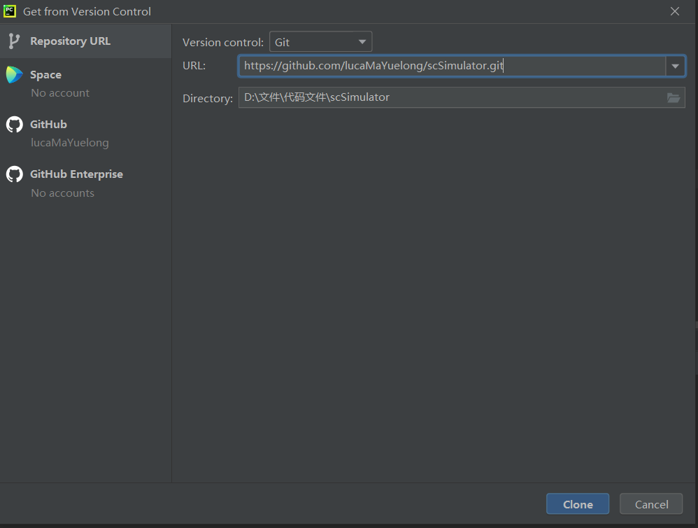
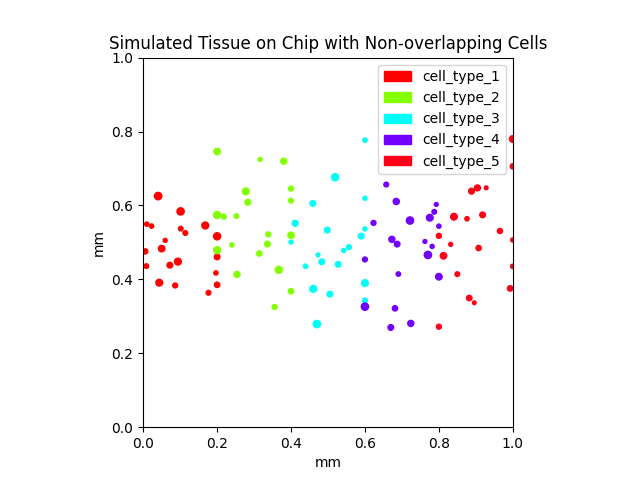

# scSimulator

Special Cell Simulator(scSimulator) is a simple simulator for simulating cell distribution.

## Overview

------

SpaSimulator is an open source python package. It uses mathematical functions such as binomial distribution and normal distribution to simulate gene expression in cells, which is similar to real data. It uses Gaussian mixture distribution to simulate the simple distribution of different cell types in tissues.

## Installation

------

Get HTTPS from Github

```
https://github.com/lucaMaYuelong/scSimulator.git
```

Create new project on Pycharm --> VCS --> Get from Version Control --> Input url


### Dependencies:

```
pandas==2.2.2
numpy==1.26.4
anndata
argparse==1.3.0
matplotlib==3.8.4
python>=3.12.4
```

## Usage

------

This tool is used to for gene expression simulation, differential gene simulation and cell distribution simulation. The main function include:

- Generate gene expression data
- Combine gene and cell information
- Make h5ad file in anndata format
- Simulate cell distribution through different cell types
- Make picture to study

### Example workflow:

Windows:

Change parameters in SimulatorClass.py

```
if __name__ == '__main__':
    num_cells = 100
    num_genes = 1000
    num_types = 5
    num_marker_gene = 10
    gene_expression_count = 125
    h5ad_path = 'simulate_data.h5ad'
    chip_size_mm = 1
    min_cell_radius = 0.005
    max_cell_radius = 0.01
    simulator = Simulator()
    adata = simulator.make_data(num_cells, num_genes, num_types, num_marker_gene, gene_expression_count)
    simulator.generate_h5ad_file(adata, h5ad_path)
    simulator.simulate(adata, num_types, chip_size_mm, min_cell_radius, max_cell_radius, num_cells)
```

Linux:

Understand parameters in main.py

```
if __name__ == '__main__':
    args = parse_args()
    num_cells = args.num_cells
    num_genes = args.num_genes
    cell_types = args.cell_types
    num_marker_genes = args.num_marker_genes
    gene_expression_count = args.gene_expression_count
    scSimulate_data_h5ad_path = args.scSimulate_data_h5ad_path
    chip_size_mm = args.chip_size_mm
    min_radius_mm = args.min_radius_mm
    max_radius_mm = args.max_radius_mm

    # simulate data
    madata = md.combine_cell_gene_with_markers(num_cells, num_genes, cell_types, num_marker_genes, gene_expression_count)

    # generate h5ad file
    md.h5ad_file(madata, scSimulate_data_h5ad_path)

    # simulate
    sl.simulate(madata, cell_types, chip_size_mm, min_radius_mm, max_radius_mm, num_cells)
```

Input parameters

```
python main.py -nc 100 -ng 1000 -ct 5 -nmg 10 -gec 125 -dp 'simulate_data.h5ad' -cs 1 -minr 0.005 -maxr 0.01
```

### Parameters expalanation:

```
('-nc', '--num_cells', meaning='Enter the number of cells to be generated')
('-ng', '--num_genes', meaning='Enter the number of genes to be generated')
('-ct', '--cell_types', meaning='Enter the number of cell types to be generated')
('-nmg', '--num_marker_genes', meaning='Enter the number of marker genes to be generated')
('-gec', '--gene_expression_count', meaning='The average expression of non-zero expression genes')
('-dp', '--scSimulate_data_h5ad_path', default='simulate_data.h5ad', meaning='The data saved in the simulation is in h5ad formate')
('-cs', '--chip_size_mm', type=int, meaning='size of chip, unit is mm')
('-minr', '--min_radius_mm', type=int, meaning='minimum radius of cells, unit is mm')
('-maxr', '--max_radius_mm', type=int, meaning='maximum radius of cells, unit is mm')
```

All results will be save in a h5ad file, default file name is `simulate_data.h5ad`

## Visualization

------

scSimulator offers a picture to show cell distribution.



